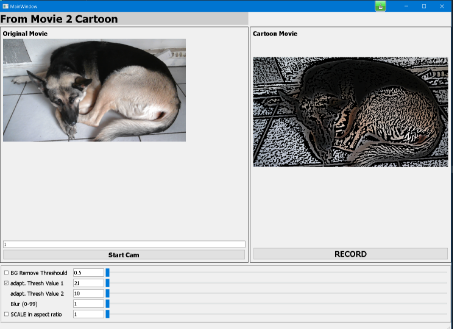
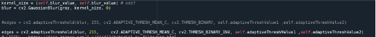
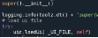
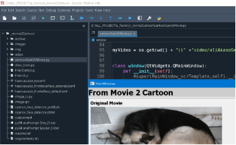

**movie2cartoon (cartoonCamOrMovie.py )**

Date: 23.07.24

## **movie2cartoon**

A python program to convert a movie / e.g. webcam video stream into cartoon style.

As there are various methods for this, the software is designed so that other (filter) methods can also be easily tested.

At the moment, adaptive threshould is mainly being tested here:

The parameters can be changed experimentally using the sliders

**Input webcam**

An external USB webcam is ideal. In my case, this camera has number 1 in my Win10 system (0 would be the one on the laptop). 

This can vary from system to system. If necessary, this can be determined more precisely using the VLC player, for example.

Dieser parameter (e.g.) wird in der pyqt5-ui gesetzt (fix parameter)..kann also beliebig auf die umgebung angepasst werden.

**Outupt**

The recorded stream ( mp4 video ) is stored in the same working directory:
 

**GUI / UI**

We use the pyQT5 UI designer to build the UI. The UI is loaded directly in cartoonCamOrMovie.py

 

**Clone and run movie2cartoon**

My environment:

AnacondaNavigator (2.6.1) + Spyder + python 3.8 environment (conda)
lokaler folder mit dem code vom repo

 

**Dependencies**

requirements.txt : ... is generating file in the working directory from movie2Cartoon

`        `pipreqs --encoding utf-8 "./"

..in case of cloning the repo..  .. in the working folder:

`        `pip install -r requirements.txt    
